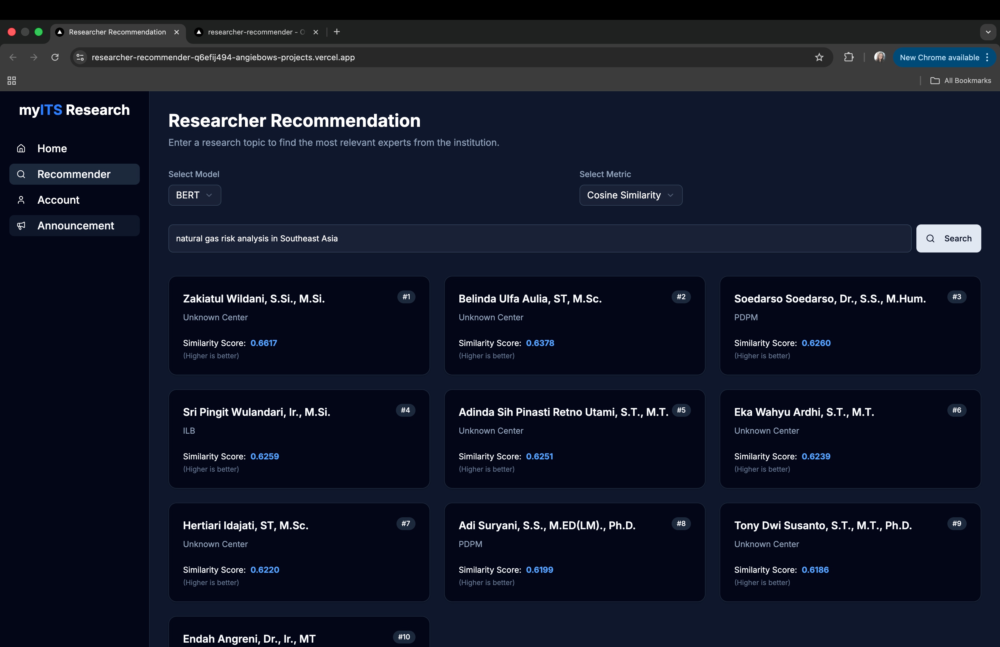

# 🔬 Researcher Recommender

[](https://researcher-recommender-git-main-angiebows-projects.vercel.app/)
[](https://angiebow-researcher-topic.hf.space)

A full-stack application that uses **transformer-based language models** to recommend **relevant researchers** based on user-input research topics.  
This project moves beyond keyword-based retrieval to provide **semantically rich, context-aware** recommendations.

---

## 🧠 Abstract

A recommendation system is one of the key applications of machine learning, designed to predict or suggest items relevant to users. In the academic domain, such systems can identify suitable researchers for specific topics. However, many existing methods rely heavily on keyword matching or shallow statistical techniques, which fail to capture deeper semantic relationships.

This study introduces a **transformer-powered researcher recommendation system** that leverages publication records and semantic similarity metrics to deliver accurate and context-aware recommendations.  
Experiments explore combinations of data variants, transformer models, and similarity-distance measures to identify the most optimal setup. Evaluation is conducted using **Top-K** and **beyond-accuracy** metrics, providing a comprehensive assessment of recommendation quality.  
The dataset comprises textual publication data collected from the institution’s research information management platform.

---

## ✨ Live Demo

👉 **Try it now:** [https://researcher-recommender-git-main-angiebows-projects.vercel.app/](https://researcher-recommender-git-main-angiebows-projects.vercel.app/)

---

## 📸 Preview



---

## 🚀 Features

- 🔍 **Semantic Search** — Enter any research topic to get expert recommendations based on contextual similarity.  
- 🤖 **Model Selection** — Choose from multiple transformer models and compare their outputs.  
- 📊 **Metric Comparison** — Experiment with different similarity/distance metrics to observe ranking variations.  
- 🌓 **Modern UI** — Clean, responsive, and dark-mode optimized interface built with Next.js and Shadcn UI.

---

## 🛠️ Tech Stack

### **Frontend**
- Framework: **Next.js (React)**
- Styling: **Tailwind CSS**, **Shadcn UI**
- Deployment: **Vercel**

### **Backend**
- Framework: **FastAPI (Python)**
- ML Libraries: **Transformers**, **Sentence-Transformers**, **PyTorch**, **scikit-learn**
- Deployment: **Hugging Face Spaces** (Dockerized)

---

## 🏗️ System Architecture

The app follows a **decoupled architecture**:  
- The **frontend** (Next.js) is hosted on **Vercel**  
- The **backend** (FastAPI) runs on **Hugging Face Spaces** in a Docker container  
- Both communicate via a REST API for seamless interaction  

---

## ⚙️ Getting Started (Local Setup)

Follow the steps below to run the project locally.

### **1. Prerequisites**
- Node.js (v18+)
- Python (v3.11+)
- Git

---

### **2. Clone the Repository**
```bash
git clone https://github.com/angiebow/ResearcherRecommender.git
cd ResearcherRecommender

# Navigate to the backend directory
cd backend

# Create and activate a Python virtual environment
python -m venv venv
source venv/bin/activate  # On macOS/Linux
# .\venv\Scripts\Activate # On Windows

# Install the required libraries
pip install -r requirements.txt

# Run the FastAPI server
uvicorn main:app --reload

# Navigate to the frontend directory
cd frontend/portal

# Install the required dependencies
npm install

# Run the Next.js development server
npm run dev
```